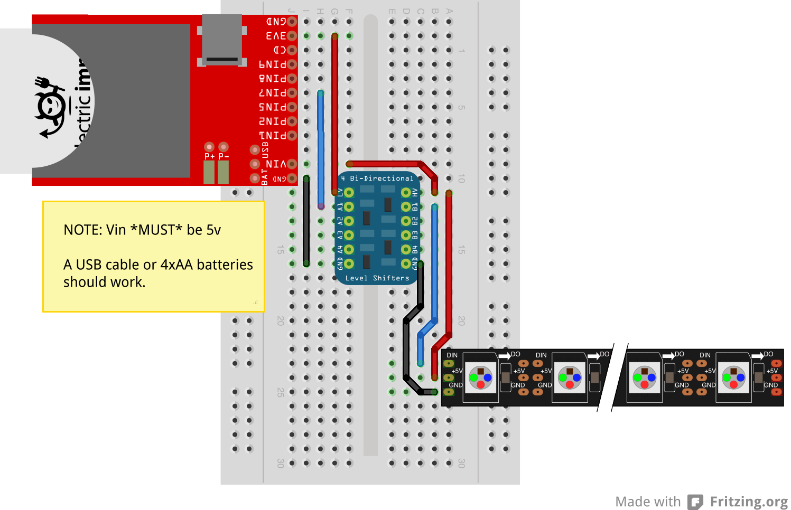

# SK6812 v1.0.0

This class allows the imp to drive SK6812 LEDs. The SK6812 is an all-in-one RGBW LED with integrated shift register and constant-current driver. The parts are daisy-chained, and a proprietary one-wire protocol is used to send data to the chain of LEDs. Each pixel is individually addressable and this allows the part to be used for a wide range of effects animations.

Some example hardware that uses the SK6812:

* [144 LED/m strip - max 4m per reel](http://www.adafruit.com/products/2848)
* [60 LED/m strip - max 4m per reel](http://www.adafruit.com/products/2837)
* [30 LED/m strip - max 4m per reel](http://www.adafruit.com/products/2824)

**To add this library to your project, add `#require "SK6812.class.nut:1.0.0"` to the top of your device code.**

You can view the library’s source code on [GitHub](https://github.com/Sparkix/SK6812/tree/v1.0.0).

## Hardware

SK6812s require a 5V power supply and logic, and each pixel can draw up to 80mA when displaying white in full brightness (using both the RGB LEDs in parallel with the W LED - typically to create full white you would just power the W portion and draw only 20mA), so be sure to size your power supply appropriatly. Undersized power supplies (lower voltages and/or insufficent current) can cause glitches and/or failure to produce and light at all.

Because SK6812s require 5V logic, you will need to shift your logic level to 5V. A sample circuit can be found below using Adafruit’s [4-channel Bi-directional Logic Level Converter](http://www.adafruit.com/products/757):



## Class Usage

All public methods in the SK6812 class return `this`, allowing you to easily chain multiple commands together:

```squirrel
pixels
    .set(0, [255,0,0,0])
    .set(1, [0,255,0,0])
    .fill([0,0,0,255], 2, 4)
    .draw();
```

### Constructor: SK6812(spi, frameSize, [draw])

Instantiate the class with a pre-configured SPI object and the number of pixels that are connected. The SPI object must be configured at 7500kHz and have the *MSB_FIRST* flag set:

```squirrel
#require "SK6812.class.nut:1.0.0"

// Configure the SPI bus
spi <- hardware.spi257;
spi.configure(MSB_FIRST, 7500);

// Instantiate LED array with 5 pixels
pixels <- SK6812(spi, 5);
```

An optional third parameter can be set to control whether the class will draw an empty frame on initialization. The default value is `true`.

## Class Methods

### configure()

Rather than pass a preconfigured SPI object to the constructor, you can pass an unconfigured SPI object, and have the *configure()* method automatically configure the SPI object for you.

**NOTE:** If you are using the *configure* method, you **must** pass `false` the the *draw* parameter of the constructor:

```squirrel
#require "SK6812.class.nut:1.0.0"

// Create and configure an LED array with 5 pixels:
pixels <- SK6812(hardware.spi257, 5, false).configure();
```

### set(*index, color*)

The *set* method changes the color of a particular pixel in the frame buffer. The color is passed as as an array of four integers between 0 and 255 representing `[red, green, blue, white]`.

NOTE: The *set* method does not output the changes to the pixel strip. After setting up the frame, you must call `draw` (see below) to output the frame to the strip.

```squirrel
// Set and draw a pixel
pixels.set(0, [127,0,0,0]).draw();
```

### fill(*color, [start], [end]*)

The *fill* methods sets all pixels in the specified range to the desired color. If no range is selected, the entire frame will be filled with the specified color.

NOTE: The *fill* method does not output the changes to the pixel strip. After setting up the frame, you must call `draw` (see below) to output the frame to the strip.

```squirrel
// Turn all LEDs off
pixels.fill([0,0,0,0]).draw();
```

```squirrel
// Set first two in the array to red
// and the middle one in the array white
// and the last two in the array to blue
pixels
    .fill([100,0,0,0], 0, 1)
    .fill([0,0,0,100], 2)
    .fill([0,0,100,0], 3, 4);
    .draw();
```

### draw()

The *draw* method draws writes the current frame to the pixel array (see examples above).

## License

The SK6812 class is licensed under the [MIT License](https://github.com/electricimp/ws2812/tree/master/LICENSE).
